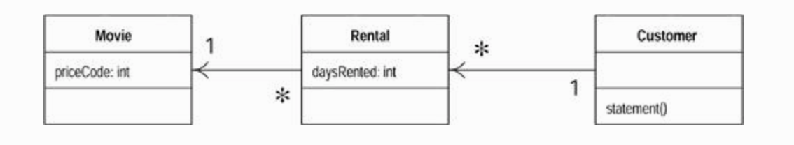
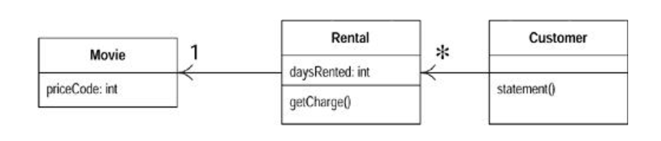
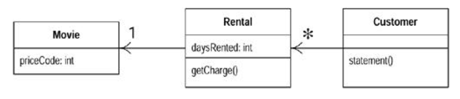
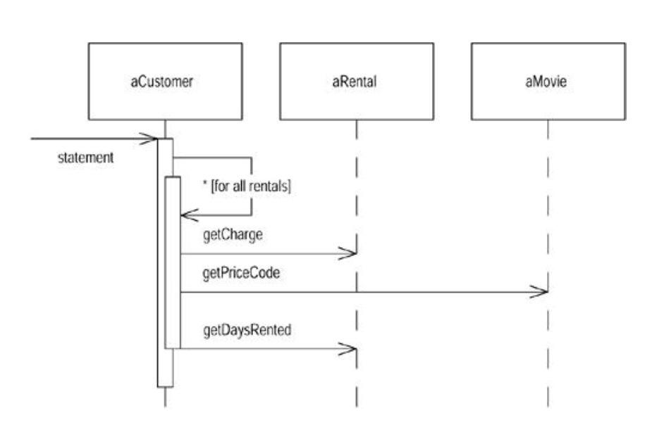
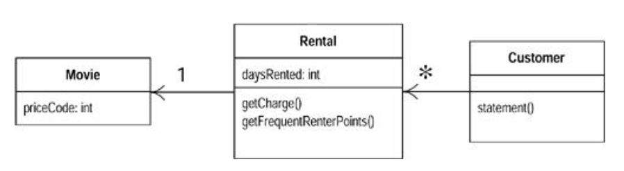
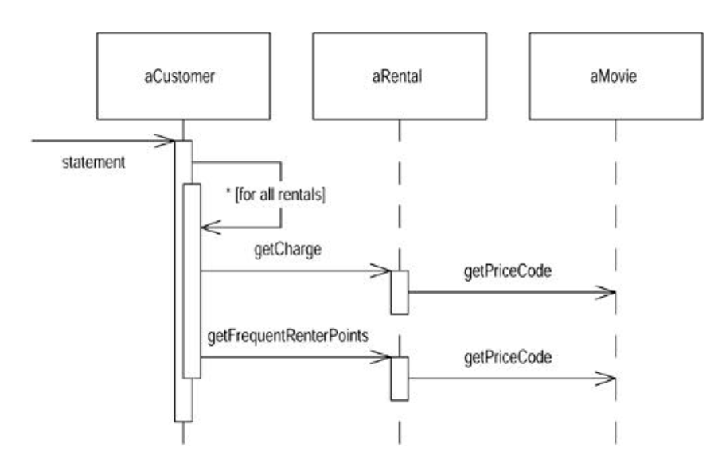
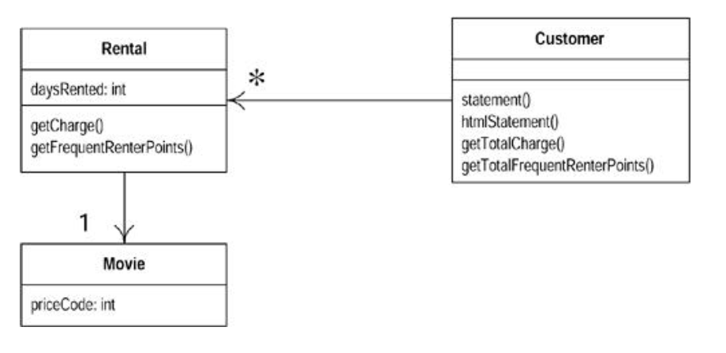
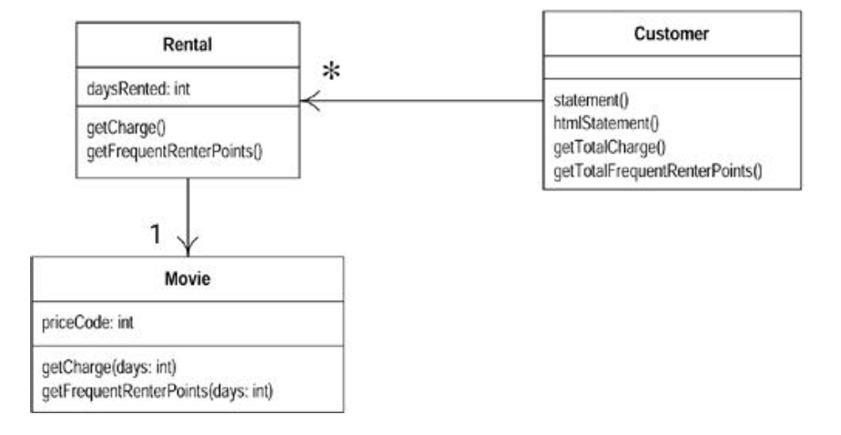
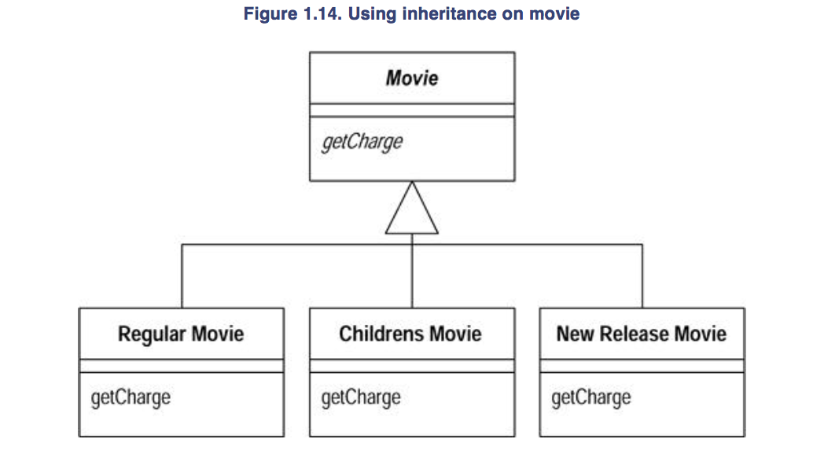
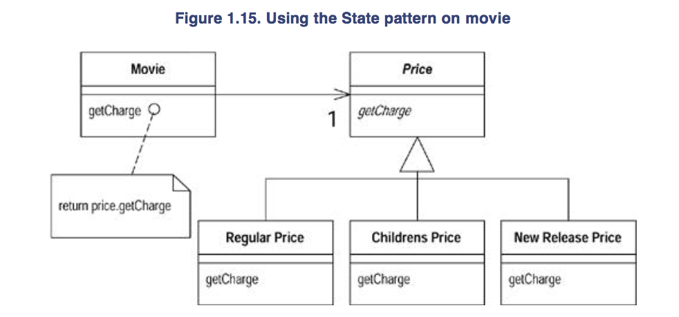

###### Refactoring Example

- Program to calculate and print a statement of a customer's charges at a video store
- Program is told which movies a customer rented and for how long
- Then calculates the charges, which depends on how long the movie is rented, and identifies the type of movie
- 3 kinds of movies: regular, children's, and new releases
- Statement also computes frequent renter points, which vary

Movie class
```
Movie is just a simple data class
public  class  Movie  {

   public  static  final  int  CHILDRENS  =  2;
   public  static  final  int  REGULAR  =  0;
   public  static  final  int  NEW_RELEASE  =  1;

   private  String  _title;
   private  int  _priceCode;

   public  Movie(String  title,  int  priceCode)  {
       _title  =  title;
       _priceCode  =  priceCode;
   }
```



```
public  int  getPriceCode()  {
       return  _priceCode;
}

Excerpt From: Fowler, Martin. “Refactoring: Improving the Design of Existing Code.” iBooks. 
```

```
public  void  setPriceCode(int  arg)  {
     _priceCode  =  arg;
}

Excerpt From: Fowler, Martin. “Refactoring: Improving the Design of Existing Code.” iBooks. 
```

```
public  String  getTitle  (){
       return  _title;
   };
 }

Excerpt From: Fowler, Martin. “Refactoring: Improving the Design of Existing Code.” iBooks. 
```


Rental
- The rental class represents a customer renting a movie

```
class  Rental  {
     private  Movie  _movie;
     private  int  _daysRented;

     public  Rental(Movie  movie,  int  daysRented)  {
       _movie  =  movie;
       _daysRented  =  daysRented;
     }
     public  int  getDaysRented()  {
       return  _daysRented;
     }
     public  Movie  getMovie()  {
        return  _movie;
     }
 }
```

Customer
- Customer class represents the customer of the store. Like the other classes it has data and accessors

```
class  Customer  {
   private  String  _name;
   private  Vector  _rentals  =  new  Vector();

   public  Customer  (String  name){
       _name  =  name;
   };

   public  void  addRental(Rental  arg)  {
     _rentals.addElement(arg);
   }
   public  String  getName  (){
        return _name;
   }
}

```

- Customer also has the method that produces a statement
- Figure 1.2 shows this interfactoring


```
public  String  statement()  {
        double  totalAmount  =  0;
        int  frequentRenterPoints  =  0;
        “Enumeration  rentals  =  _rentals.elements();
        String  result  =  "Rental  Record  for  "  +  getName()  +  "\n";
        while  (rentals.hasMoreElements())  {
            double  thisAmount  =  0;
            Rental  each  =  (Rental)  rentals.nextElement();

            //determine  amounts  for  each  line
            switch  (each.getMovie().getPriceCode())  {
                case  Movie.REGULAR:
                    thisAmount  +=  2;
                    if  (each.getDaysRented()  >  2)
                        thisAmount  +=  (each.getDaysRented()  -  2)  *  1.5;
                    break;
                case  Movie.NEW_RELEASE:
                    thisAmount  +=  each.getDaysRented()  *  3;
                    break;
                case  Movie.CHILDRENS:
                    thisAmount  +=  1.5;
                    if  (each.getDaysRented()  >  3)
                        thisAmount  +=  (each.getDaysRented()  -  3)  *  1.5;
                    break;

            }

            //  add  frequent  renter  points
            frequentRenterPoints  ++;
            //  add  bonus  for  a  two  day  new  release  rental
            if  ((each.getMovie().getPriceCode()  ==  Movie.NEW_RELEASE)  &&
each.getDaysRented()  >  1)  frequentRenterPoints  ++;

            //show  figures  for  this  rental
            result  +=  "\t"  +  each.getMovie().getTitle()+  "\t"  +
String.valueOf(thisAmount)  +  "\n";
            totalAmount  +=  thisAmount;

        }
        //add  footer  lines
        result  +=  "Amount  owed  is  "  +  String.valueOf(totalAmount)  +  "\n";
        result  +=  "You  earned  "  +  String.valueOf(frequentRenterPoints)  + " frequent renter points";
        return result;
}
```


######## Comments on the Starting Program

- Fine for quick and dirty `simple` program
- But if this a representative fragment of a more complex system, then problems
- Long statement routine in the Customer class does far too much
- Many of the things that it does should really be done by other classes
- A poorly designed system is hard to change
- Hard because it is hard to figure out where the changes are needed
- As a result, there is strong change that the programmer will make a mistake and introduce bugs

`First change`
- In this case, we have a change that the users would like to make
- They want a statement printed in HTML so that the statement can be web enabled and fully buzzword compliant
- It is currently impossible to reuse any of the behavior of the current statement method for an HTML statement
- Have to write a whole new methd that duplicates much of the behavior in the statement
- You can just copy the statement method and make whatever changes you need
- But what happens when the charging rules change?
- You have to fix both `statement` and `htmlStatement` and ensure the fixes are consistent
- The problem with copying and pasting code comes when you have to change it later
- If you are writing a program that you don't expect to change, then cut and paste is fine
- If the program is long lived and likely to change, then cut and paste is a menance

`Second change`
- Users want to make changes to the way they classify movies, but they haven't yet decided on the change they are going to make
- Number of changes in mind
- These changes will affect both the way renters are charged for movies and the way that frequent renter points are calculated
- As an experienced developer, you are sure that whatever scheme users come up with, the only guarantee you're going to have is that they will change it again in 6 months

- The statement method is where the changes have to be made to deal with changes in classification and charging rules
- If however, we copy the statement to an HTML statement, we need to ensure that any changes are completely consistent
- As the rules grow in complexity it's going to be harder to figure out where to make the changes and harder to make them w/o making a mistake

- You may be tempted to make the fewest possible changes to the program (after all it works fine)
- `If it ain't broke, don't fix it` - the program may not be broken, but it does hurt
- It is making your live more difficult b/c you find it hard to make the changes the users want
- This is where refactoring comes in

Tip
```
When you find you have to add a feature to a program, and the program's code is not structured in a covenient way to add the feature, first refactor the program to make it easy to add the feature, then add the feature
```

###### The First Step in Refactoring

- Whenever refactoring is done, first step is always the same
- Need to build a solid set of tests for that section of code
- Need tests to catch potential bugs

- B/c the statement result produces a string, I create a few customers, give each a few rentals of various kinds of films, and generate the statement strings
- Then do a string comparison between the new string and some reference strings that I have hand checked
- Tests should be self checking - `very important` 

- Essential for refactoring that you have good tests
- Worth spending the time to build the tests b/c the tests give you the security you need to change the program later

Tip
```
Before you start refactoring, check that you have a solid suite of tests. These tests must be self-checking
```

###### Decomposing and Redistributing the Statement Method

- Target of attention is the overly long statement method
- Going to decompose the method into smaller pieces

Step 1:
- Find logical clump of code and use the `Extract Method`
- Obvious piece here is the switch statement
- Good chunk to extract into its own method

- When extracting a method, as in any refactoring, need to know what can go wrong
- If extraction done badly, could introduce a bug into the program
- Before doing refactoring, need to figure out how to do it safely

- First need to look in the fragment for any variables that are local in scope to the method we are looking at, the local variables and parameters
- This segement of code uses two: `each` and `thisAmount`
- Of these, `each` is not modified by code but `thisAmount` is modified
- Any `nonmodified` variable can be passed in as a parameter
- `Modified` variables need more care

- Author moves switch case into new function that takes a `rental` as an input
- Test

Tip
```
Refactoring changes the program in small steps. If you make a mistake, it is easy to find the bug
```

- Because each change is small, any errors are very easy to find

- Is renaming worth the effort?
- Absolutely, good code should communicate what it is doing clearly, and variable names are a key to clear code

Tip
```
Any fool can write code that a computer can understand. Good programmers write code that humans can understand
```

- Code that communicates its purpose is very important
- Author often refactors just when reading some code
- Gain understanding about the program, and embed that understanding into the code for later so I don't forget what I learned

######## Moving the Amount Calculation

- Looking at `amountFor`, it can be seen that it uses information from the rental, but does not use information from the customer
- `Method is probably on the wrong object in this case`
- In most cases, a method should be on the object whose data it uses, thus the method should be moved to the rental
- Method should be moved to the `rental`
- Use the `Move Method`
- With this you first copy the code over to rental, adjust it to fit in its new home

```
class Rental...
        double getCharge() {
                double result = 0;
                switch (getMovie().getPriceCode()) {
                        case Movie.REGULAR:
                                result += 2;
                                if (getDaysRented() > 2)
                                        result += (getDaysRented() - 2 ) * 1.5;
                                break;
                        case Movie.NEW_RELEASE:
                                results += getDaysRented() * 3;
                                break;
                        case Movie.CHILDRENS:
                                result += 1.5;
                                if (getDaysRented() > 3)
                                        result += (getDaysRented() - 3) * 1.5;
                                break;
                }
                return result;
        }
```

- Removing parameter to `getCharge()` (previously `amountFor`)
- Test

```
class Customer...
        private double amountFor(Rental aRental) {
                return aRental.getCharge();
        }
```

- Test



- More to do with `Rental.getCharge` but returning to `Customer.statement` for now

- Next thing is `thisAmount` is redundant
- It is set to the result of `each.charge` and not changed afterward

```
public String statement() {
        double totalAmount = 0;
        int frequentRenterPoints = 0;
        Enumeration rentals = _rentals.elements();
        String result = "Rental Record for " + getName() " "\n";
        while (rentals.hasMoreElements()) {
                double thisAmount = 0;
                Rental each = (Rental) rentals.nextElement();

                thisAmount = "each.getCharge()";

                // add frequent renter points
                frequentRenterPoints ++;
                // add bonus for a two day new release rental
                if ((each.getMovie().getPriceCode() == Movie.NEW_RELEASE) && each.getDaysRented() > 1) frequentRenterPoints ++;
                result += "\t" + each.getMovie().getTitle() + "\t" + String.valueOf(thisAmount) + "\n"
                totalAmount += this.Amount;
        }
        // add footer lines
        result += "Amount owed is " + String.valueOf(totalAmount) + "\n";
        result += "You earned " + String.valueOf(frequentRenterPoints) + " frequent renter points";
        return result;
}
```

- Can eliminiate `thisAmount` by using `Replace Temp with Query`

```
public String statement() {
        double totalAmount = 0;
        int frequentRenterPoints = 0;
        Enumeration rentals = _rentals.elements();
        String result = "Rental Record for " + getName() " "\n";
        while (rentals.hasMoreElements()) {
                Rental each = (Rental) rentals.nextElement();

                // add frequent renter points
                frequentRenterPoints ++;
                // add bonus for a two day new release rental
                if ((each.getMovie().getPriceCode() == Movie.NEW_RELEASE) && each.getDaysRented() > 1) frequentRenterPoints ++;
                result += "\t" + each.getMovie().getTitle() + "\t" + String.valueOf("each.getCharge()") + "\n"
                totalAmount += "each.getCharge()";
        }
        // add footer lines
        result += "Amount owed is " + String.valueOf(totalAmount) + "\n";
        result += "You earned " + String.valueOf(frequentRenterPoints) + " frequent renter points";
        return result;
}
```

- Author likes to get rid of temporary variables such as this as much as possible
- Temps are often a problem in that they cause a lot of parameters to be passed around when they don't have to be
- You can easily lose track of what they are for
- They are particularly painful in long methods
- `We do pay for performance in this case as a result of this refactoring, the charge is now calculated twice`
- Easy to optimize that in the rental class

######## Extracting Frequent Renter Points

- Next step is to do something similar for the frequent renter points
- The rules vary with the tape, although there is less variation than with charging
- First need to use `Extract Method` on the frequent router points part of the code

```
public String statement() {
        double totalAmount = 0;
        int frequentRenterPoints = 0;
        Enumeration rentals = _rentals.elements();
        String result = "Rental Record for " + getName() " "\n";
        while (rentals.hasMoreElements()) {
                Rental each = (Rental) rentals.nextElement();

                ***
                // add frequent renter points
                frequentRenterPoints ++;
                // add bonus for a two day new release rental
                if ((each.getMovie().getPriceCode() == Movie.NEW_RELEASE) && each.getDaysRented() > 1) frequentRenterPoints ++;
                ***

                result += "\t" + each.getMovie().getTitle() + "\t" + String.valueOf("each.getCharge()") + "\n"
                totalAmount += "each.getCharge()";
        }
        // add footer lines
        result += "Amount owed is " + String.valueOf(totalAmount) + "\n";
        result += "You earned " + String.valueOf(frequentRenterPoints) + " frequent renter points";
        return result;
}
```

- Again look at the use of locally scope variables
- Again `each` is used and can be passed as a parameter
- The other temp used is `frequentRenterPoints`
- In this case `frequentRenterPoints` does not have a value beforehand
- The body of the extracted method doesn't read the value, so we don't need to pass it in as a parameter as long as we use an appending assignment


```
class Customer...

public String statement() {
        double totalAmount = 0;
        int frequentRenterPoints = 0;
        Enumeration rentals = _rentals.elements();
        String result = "Rental Record for " + getName() " "\n";
        while (rentals.hasMoreElements()) {
                Rental each = (Rental) rentals.nextElement();

                *** frequentRenterPoints += each.getFrequentRenterPoints(); ***

                result += "\t" + each.getMovie().getTitle() + "\t" + String.valueOf("each.getCharge()") + "\n"
                totalAmount += "each.getCharge()";
        }
        // add footer lines
        result += "Amount owed is " + String.valueOf(totalAmount) + "\n";
        result += "You earned " + String.valueOf(frequentRenterPoints) + " frequent renter points";
        return result;
}

class Rental ...
int getFrequentRenterPoints() {
        if ((getMovie().getPrice() == Movie.NEW_RELEASE) && getDaysRented() > 1)
                return 2;
        else
                return 1;
}

```

- Author summarizes changs in two below diagrams

Figure 1.4 - Class diagram before extraction and movement of frequent renter points calculation



Figure 1.5 - Sequence diagrams before extraction and movement of frequent renter points calculation



Figure 1.6 - Class diagram after extraction and movement of the frequent renter points calculation



Figure 1.7 - Sequence diagram before extraction and movement of the frequent renter points calculation



######## Removing Temps

- Temporary variables can be a problem
- They are useful only within their own routine, and thus encourage long, complex routines
- In this case we have two temporary variables, both of which are being used to get a total from the rentals attached to the customer
- Both ASCII and HTML versions require these totals
- Use `Replace Temp with Query` to replace `totalAmount` and `frequentRentalPoints` with query methods
- Queries are accessible to any method in the class and thus encourage a cleaner design without long, complex methods

```
class Customer...

public String statement() {
        double totalAmount = 0;
        int frequentRenterPoints = 0;
        Enumeration rentals = _rentals.elements();
        String result = "Rental Record for " + getName() " "\n";
        while (rentals.hasMoreElements()) {
                Rental each = (Rental) rentals.nextElement();
                frequentRenterPoints += each.getFrequentRenterPoints();

                result += "\t" + each.getMovie().getTitle() + "\t" + String.valueOf("each.getCharge()") + "\n"
                totalAmount += "each.getCharge()";
        }
        // add footer lines
        result += "Amount owed is " + String.valueOf(totalAmount) + "\n";
        result += "You earned " + String.valueOf(frequentRenterPoints) + " frequent renter points";
        return result;
}
```

- Begin by replacing `totalAmount` with a `charge` method on customer

```
Customer...

public String statement() {
        double totalAmount = 0;
        int frequentRenterPoints = 0;
        Enumeration rentals = _rentals.elements();
        String result = "Rental Record for " + getName() " "\n";
        while (rentals.hasMoreElements()) {
                Rental each = (Rental) rentals.nextElement();
                frequentRenterPoints += each.getFrequentRenterPoints();

                result += "\t" + each.getMovie().getTitle() + "\t" + String.valueOf(each.getCharge()) + "\n"
        }
        // add footer lines
        result += "Amount owed is " + String.valueOf(***getTotalCharge()***) + "\n";
        result += "You earned " + String.valueOf(frequentRenterPoints) + " frequent renter points";
        return result;
}

private double getTotalCharge() {
        double result = 0;
        Enumeration rentals = _rentals.elements();
        while (rentals.hasMoreElements()) {
                Rental each = (Rental) rentals.nextElement();
                result += each.getCharge();
        }
        return result;
}
```

- This isn't the simplest case of `Replace Temp with Query` b/c `totalAmount` was assigned to within the loop, so loop has to be copied into the query method

```
Customer...

public String statement() {
        double totalAmount = 0;
        int frequentRenterPoints = 0;
        Enumeration rentals = _rentals.elements();
        String result = "Rental Record for " + getName() " "\n";
        while (rentals.hasMoreElements()) {
                Rental each = (Rental) rentals.nextElement();
                frequentRenterPoints += each.getFrequentRenterPoints();

                result += "\t" + each.getMovie().getTitle() + "\t" + String.valueOf(each.getCharge()) + "\n"
        }
        // add footer lines
        result += "Amount owed is " + String.valueOf(***getTotalCharge()***) + "\n";
        result += "You earned " + String.valueOf(***getTotalFrequentRenterPoints()***) + " frequent renter points";
        return result;
}

private double getTotalCharge() {
        double result = 0;
        Enumeration rentals = _rentals.elements();
        while (rentals.hasMoreElements()) {
                Rental each = (Rental) rentals.nextElement();
                result += each.getCharge();
        }
        return result;
}

private int getTotalFrequentRenterPoints() {
        int result = 0;
        Enumeration results = _rentals.elements();
        while (rentals.hasMoreElements()) {
                Rental each = (Rental) rentals.nextElement();
                result += each.getFrequentRenterPoints();
        }
        return result;
}
```

- Figure 8 - 11 show the change for these refactorings in class diagrams and the interaction diagram for the statement method

- Worth stopping to think a bit about the last refactoring
- Most refactorings reduce the amount of code, `but this one increases it`
- This is a result of Java 1.1

- Other concern with this refactoring lies in performance
- The old code executed the `while` loop once, the new code executes it 3 times
- A while loop that takes a long time might impair performance
- Many programmers would not do this refactoring simply for this reason
- Don't worry about this while refactoring
- When you optimize you will have to worry about it, but you will be in a much better position to do something about it, and you will have more options to optimize efficiently

- These queries are now available for any code written in the customer class
- They can easily be added to the interface of the class should other parts of the system need this information
- W/o queries like this, other methods have to deal with knowing about the rentals and building the loops
- In complex system, that will lead to much more code to write and maintain

- You can see the difference with the `htmlStatement`
- Can now write `htmlStatement` as follows

```
public String htmlStatement() {
        Enumeration results = _rentals.elements();
        String result = "<H1>Rentals for <EM>" + getName() + "</EM></H1><P>\n"
        while (rentals.hasMoreElements()) {
                Rental each = (Rental) rentals.nextElement();

                // show figures for each rental
                results = each.getMovie().getTitle() + ": " + String.value(each.getCharge()) + "<BR\n>";
        }
        // add footer lines
        result += "<P>You owe "<EM>" String.valueOf(getTotalCharge()) + "</EM><P>\n";
        result += "On this rental you earned <EM>" + String.valueOf(getTotalFrequentRenterPoints()) + "</EM> frequent renter points<P>";
        return result;
}
```

- By extracting the calculations I can create the `htmlStatement` method and reuse all of the calculation code that was in the original statement method
- Didn't copy and paste, so if the calculation rules change, only one place in the code to go to
- Any other kind of statement will be really quick and easy to prepare
- Refactoring did not take long
- Spent most of the time figuring out what the code did, and I would have had to do that anyway

- Some code is copied from the ASCII version, mainly due to setting up th eloop
- Further refactoring could clean this up
- Extracing methods for header, footer, and detail line are one route to take
- Can see how to do this in the example for `Form Template method`


- Another thing is now changing
- Getting ready to change the classification of the movies in the store
- Not clear what changes they want to make, but it sounds like new classifications will be introduced, and existing ones could change
- The charges and the frequent renter point allocations for these classifications are to be decided
- At the moment, making these kinds of changes is awkward
- Have to get into the charge and frequent renter point methods and alter conditional logic to make changes to film classifications

########## Replacing Conditional Logic on Price Code with Polymorphism

- First part of this problem is that switch statement.
- Bad idea to do a switch based on an attribute of another object
- If you must use a switch statement, it should be on your own data, not one someone else's

```
class Rental...
        double getCharge() {
                double result = 0;
                switch (getMovie().getPriceCode()) {
                        case Movie.REGULAR:
                                result += 2;
                                if (getDaysRented() > 2) 
                                        result += (getDaysRenter() - 2) * 1.5;
                                break;
                        case Movie.NEW_RELEASE:
                                result += getDaysRented() * 3;
                        case Movie.CHILDRENS:
                                result += 1.5;
                                if (getDaysRented() > 3) 
                                        result += (getDaysRented() -3) * 1.5;
                                break;
                }
                return result;
        }
```

- This imples that `getCharge` should move into `movie`

```
class Movie...
        double getCharge(int daysRented) {
                double result = 0;
                switch (getPriceCode()) {
                        case Movie.REGULAR:
                                result += 2;
                                if (daysRented > 2) 
                                        result += (daysRented - 2) * 1.5;
                                break;
                        case Movie.NEW_RELEASE:
                                result += daysRented * 3;
                        case Movie.CHILDRENS:
                                result += 1.5;
                                if (getDaysRented() > 3) 
                                        result += (daysRented -3) * 1.5;
                                break;
                }
                return result;
        }
```

- For this to work, had to pass in the length of the rental, which is data from rental
- The method effectively uses pieces of data
        * The length of the rental
        * The type of the movie
- Why pass the length of rental to the movie rather than the movie type to the rental?
- It's b/c the proposed changes are all about adding new types
- `Type information generally tends to be more volatile`
- It you change the movie type, you want the least ripple effect, so prefer to calculate the charge within the movie

- Changed the `getCharge` on rental to use the new method (Figure 12 and 13)

Figure 12 - Class diagram before moving methods to movie


Figure 13 - Class Diagram after moving methods to movie


- Once moved the `getCharge` method, do the same with the frequent renter pont calculation
- `That keeps both things that vary with the type together on the class that has the type`

```
Class Rental...
        int getFrequentRenterPoints() {
                if ((getMovie().getPriceCode() == Movie.NEW_RELEASE) && getDaysRented() > 1)
                        return 2;
                else
                        return 1;
        }
```

Changes into

```
Class Rental...
        int getFrequentRenterPoints() {
                return _movie.getFrequentRenterPoints(_daysRented);
        }

Class Movie...
        int getFrequentRenterPoints(int daysRented) {
                if ((getMovie().getPriceCode() == Movie.NEW_RELEASE) && getDaysRented() > 1)
                        return 2;
                else
                        return 1;
        }
```

########## At last...Inheritance

- We have several types of movies that have different ways of answering the same question
- This sounds like a job for subclasses
- Have 3 subclasses 



- Allows you to replace the switch statemnt by using polymorphism



- By adding the indirection, we can do subclassing from the price code object and change the price whenever we need to

Page 38