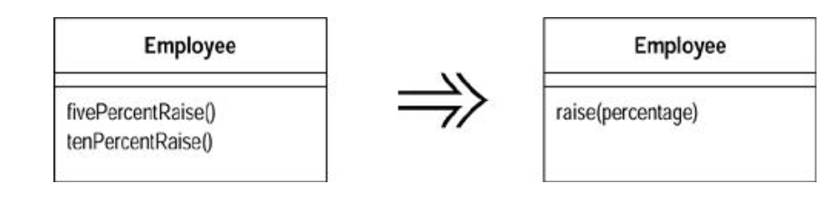

###### Parameterize Method

- Several methods do similar things but with different values contained in the method body

`Create one method that uses a parameter for the different values

######## Motivaiton

- You may see a couple of methods that do similar things but vary depending on a few values
- In this case you can simply matters by replacing the separate methods with a single method that handles the variations by parameters
- Such a change removes duplicate code and icnreases flexibility b/c you can deal with other variations by adding parameters

######## Mechanics

* Create a parameterized method that can be subsituted for each repetitive method
* Replace one method with a call to the new method
* Test
* Repeat for all methods, test after replacing each one

- The trick is to spot code that is repetitive on the basis of a few values that can be passed in as parameters
