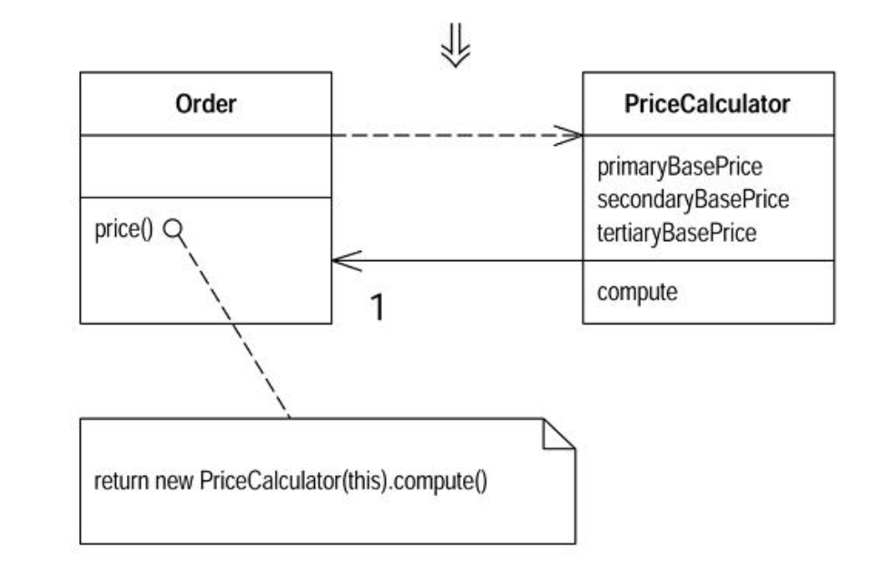

#### Replace Method with Method Object

- You have a long method that uses local variables in such a way that you cannot apply `Extract Method`

- `Turn the method into its own object so that all the local variables become fields on that object. You can then decompose the method into other methods on the same object`

```
class Order...
    double price() {
        double primaryBasePrice;
        double secondaryBasePrice;
        double tertiaryBasePrice;
        // long computation;
        ...
    }
```



###### Motivation

- In this book, beauty of small methods is emphasized
- By extracting pieces out of a large method, you make things much more comprehensible

- Difficulty in decomposing a method lies in local variables
- If they are everywhere in a method, decomposition can be difficult
- Using `replace temp with query` helps to reduce this burden, but occassionally you may find that you cannot break down a method that needs breaking
- In this case you reach deep into the tool bag and get out your `method object`

- Applying `Replace Method with Method Object` turns all these local variables into fields on a method object
- You can then use `Extract Method` on this new object to create additional methods that break down the original method

###### Mechanics

- Create a new class, name it after the method
- Give the new class a final field for the object that hosted the original method (the source object) and a field for each temp variable and each parameter in the method
- Give the new class a constructor that takes the source object and each parameter
- Give the new class amethod name `compute`
- Copy the body of the original method into compute. Use the source object field for any invocations of methods on the original object
- Replace the old method with one that creates the new object and calls compute

###### Exxample

- A proper example of this requires a long chapter, so this is showing refactoring for a method that doesn't need it

```
class Account
    int gamma (int inputVal, int quantity, int yearToDate) {
        int importantValue1 = (inputVal * quantity) + delta();
        int importantValue2 = (inputVal * yearToDate) + 100;
        if ((yearToDate - importantValue1) > 100) 
            importantValue2 -= 100'
        int importantValue3 = importantValue2 * 7;
        // and so on
        return importantValue3 - 2 * importantValue1;
    }
```

- To turn this into method object, begin by declaring a new class
- Provide a final field for the original object and a field for each parameter and temp variable in the method

```
Class Gamma...
    private final Account _account;
    private int inputVal;
    private int quantity;
    private int yearToDate;
    private int importantValue1;
    private int importantValue2;
    private int importantValue3;
```

- Add constructor

```
Gamma (Account source, int inputValArg, int quantityArg, int yearToDateArg) {
    _account = source;
    inputVal = inputValArg;
    quantity = quantityArg;
    yearToDate = yearToDateArg;
}
```

- Now you can move the original method over
- Need to modify any calls of features of account to use the `_account` field

```
int compute() {
     int importantValue1 = (inputVal * quantity) + _account.delta();
        int importantValue2 = (inputVal * yearToDate) + 100;
        if ((yearToDate - importantValue1) > 100) 
            importantValue2 -= 100'
        int importantValue3 = importantValue2 * 7;
        // and so on
        return importantValue3 - 2 * importantValue1;
}
```

- Then modify old method to delegate to the method object

```
class Account
    int gamma (int inputVal, int quantity, int yearToDate) {
       return new Gamma(this, inputVal, quantity, yearToDate).compute()
    }
```

- Benefit now is you can easily use `Extract Method` on the compute method w/o every worrying about the argument's passing

```
int compute() {
     int importantValue1 = (inputVal * quantity) + _account.delta();
        int importantValue2 = (inputVal * yearToDate) + 100;
        if ((yearToDate - importantValue1) > 100) 
            importantValue2 -= 100'
        int importantValue3 = importantValue2 * 7;
        // and so on
        return importantValue3 - 2 * importantValue1;
}

void importantThing() {
    if ((yearToDate - importantValue1) > 100)
        importantValue2 -= 20;
}
```