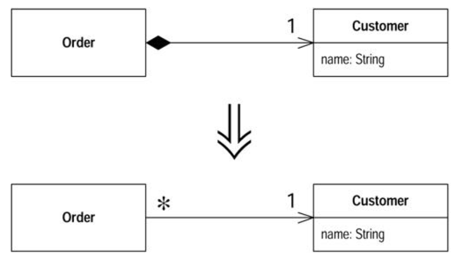

#### Change Value to Reference

- You have a class with many equal instances that you want to replace with a single object

- `Turn the object into a reference object`



###### Motivation

- You can make a useful classification of objects in many systems; reference objects and value objects
- `Reference objects` are things like `customer` or `account`
- Each object stands for one object in the real world, and you can use the object identity to test whether they are equal
- `Value objects` are things like date or money
- They are defined entirely through their data values
- You don't mind that copies exist; you may have hundreds of `1/1/2000` objects in your system
- You do need to tell whether two objects are equal, so you need to override the equals method (and the hashCode method too)

- The decision btwn references and value is not always clear
- Sometimes you start with a simple value with a small amount of immutable data
- Then you want to give it some changeable data and ensure that the change ripples to everyone referring to the object
- At this point you need to turn it into a reference object

###### Mechanics

- Use `Replace Constructor with Factory Method`
- Test
- Decide what object is responsible for providing access to the objects
    * This may be a static dictionary or a registry object
    * You may have more than one object that acts as an access point for the new object
- Decide whether the objects are precreated or created on the fly
    * If the objects are precreated and you are retrieving them from memory; ensure that they are loaded before they are needed
- Alter the factory method to return the reference object
    * If the objects are precomputed, you need to decide how to handle errors if someone asks for an object that does not exist
    * You may want to use `Rename Method` on the factory to convey that it returns an existing object
- Test

###### Example

- Starting where left off in the example `Replace Data Value with Object`
- Have following customer class

```
class Customer {
    public Customer(String name) {
        _name = name;
    }
    public String getName() {
        return _name;
    }
    private final String _name;
}
```

- It is used by an order class

```
class Order...
    public Order (String customerName) {
        _customer = new Customer(customerName);
    }
    public void setCustomer(String customerName) {
        _customer = new Customer(customerName);
    }
    public String getCustomerName() {
        return _customer.getName();
    }
    private Customer _customer;
```

- And some cient code

```
private static int numberOfOrdersFor(Collection orders, String customer) {
    int result = 0;
    Iterator iter = order.iterator();
    while (iter.hasNext()) {
        Order each = (Order) iter.next();
        if (each.getCustomerName().equals(customer)) result++;
    }
    return result;
}
```

- At the moment it is a value
- Each order has its own customer object even if they are for the same conceptual customer
- Want to cahnge this so that if we have several orders for the same conceptual customer, they share a single customer object
- For this case this means that there should be only one customer object for each customer name

- Begin by using `Replace Constructor with Factory Method`
- Allows you to take control of the creation process, which will become important later
- Define the factory method on the customer

```
class Customer {
    public static Customer create(String name) {
        return new Customer(name);
    }
}
```

- Then replace the calls to the constructor with calls to the factory

```
class Order {
    public Order(String customer) {
        _customer = Customer.create(customer);
    }
}
```

- Then make the constructor private

```
private Customer {
    private Customer (String name) {
        _name = name;
    }
}
```

- Now have to decide how to access the customers
- Preference is to use another object
- Such a situation works well with something like the line items of an order
- The order is responsible for providing access to the line items
- However, in this situation there ins't such an obvious object
- In this situation, try something like creating a registry object to be the access point
- For simplicty in this example, author stores them using a static field on customer, making the customer class the access point

`private static Dictionary _instances = new Hashtable();`

- Then decide whether to create customers on the fly when asked or to create them in advance
- Will use the latter
- In application start up code, load the customers that are in use
- These could come from a database or from a file
- For simpliciy, author uses explicit code
- Can always use `Subsitute Algorithm` to change it later

```
class Customer...
    static void loadCustomers() {
        new Customer("Person 1").store();
        new Customer("Person 2").store();
        new Customer("Person 3").store();
    }
    private void store() {
        _instances.put(this.getName(), this);
    }
```

- Now alter the factory ethod to return the precreated customer:

```
public static Customer create(String name) {
    return (Customer) _instances.get(name);
}
```

- B/c the create method always returns an existin customer, should make this clear by using `Rename Method`

```
class Customer...
    public static Customer getNamed(String name) {
        return (Customer) _instances.get(name);
    }
```