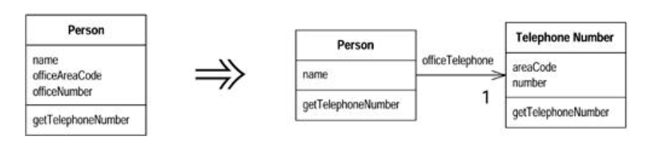

#### Extract Class

- You have one class done work that should be done by two

- `Create a new class and move the relevant fields and methods from the old class into the new class



###### Motivation

- Ideally, a class should be a crisp abstraction, handle a few clear responsibilities, or some similar guideline
- In practice, classes grow
- You add some operations here, a bit of data there
- You add a responsibility to the class feeling that it's not worth a separate class, but as that responsibilitiy grows, the class becomes too complicated
- Soon your class is no longer a crisp abstraction

- Such a class is one with many methods and quite a lot of data
- A class that is too big to understand easily
- You need to consider where it can be split, and you split it
-- A good sign that a subset of data and a subset of methods seem to go together
- Other good signs are subsets of data that usually change together or are particularly dependent on each other
- A useful test is to ask yourself what would happen if you removed a piece of data or method
- What other fields and methods would become nonsense?

###### Mechanics

- Decide how to split the responsibilities of the class
- Create a new class to express the split-off responsibilities
    * If the responsibilities of the old class no longer match its name, rename the class
- Make a link from the old class to the new class
    * May need a two-way link
    - But don't make the back link until you find you need it
- Use `Move Field` on each field you wish to move
- Test after each move
- Use `Move Method` to move methods over from old to new. Start with lower-level methods (`called rather than calling`) and build to the higher level
- Test after each move
- Review and reduce the interfaces of each class
    * If you did have a two-way link, examine to see whether it can be made one way
- Decide whether to expose the new class
- If you do expose the class, decide whether to expose it as a reference object or as an immutable value object

###### Example

```
class Person...
    public String getName() {
        return _name;
    }
    public String getTelephoneNumber() {
        return ("(" + _officeArea Code + ") " + _officeNumber);
    }
    String getOfficeAreaCode() {
        return _officeAreaCode;
    }
    void setOfficeAreaCode(String arg) {
        _officeAreaCode = arg;
    }
    String getOfficeNumber() {
        return _officeNumber;
    }
    void setOfficeNumber(String arg) {
        _officeNumber = arg;
    }

    private String _name;
    private String _officeAreaCode;
    private String _officeNumber;
```

- In this case you can separate the telephone number behavior into its own class
- Start by defining a telephone number class

```
class TelephoneNumber {

}
```

- Next make a link from the person to the telephone number

```
class Person
    private TelephoneNumber _officeTelephone = new TelephoneNumber();
```

- Now use `Move Field` on one of the fields

```
class TelephoneNumber {
    String getAreaCode() {
        return _areaCode;
    }
    void setAreaCode(String arg) {
        _areaCode = arg;
    }
    private String _areaCode;
}

class Person...
    public String getName() {
        return _name;
    }
    public String getTelephoneNumber() {
        return ("(" + getOfficeAreaCode() + ") " + _officeNumber);
    }
    String getOfficeAreaCode() {
        return _officeAreaCode.getAreaCode();
    }
    void setOfficeAreaCode(String arg) {
        _officeTelephone.setAreaCode(arg);
    }
```

- Can then move the other field and use `Move Method` on the telephone number

```
class Person...
    public String getName() {
        return _name;
    }
    public String getTelephoneNumber() {
        return _officeTelephone.getTelephoneNumber();
    }
    TelephoneNumber getOfficeTelephone() {
        return _officeTelephone;
    }

    private String _name;
    private TelephoneNumber _officeTelephone = new TelephoneNumber();


class TelephoneNumber {
    public string getTelephoneNumber() {
        return ("(" + _areaCode + ") " + _number);
    }
    String getAreaCode() {
        return _areaCode;
    }
    void setAreaCode(String arg) {
        _areaCode = arg;
    }
    String getNumber() {
        return _number;
    }
    void setNumber(String arg) {
        _number = arg;
    }
    private String _number;
    private String _areaCode;
}
```

- The decision then is how much to expose the new class to your clients
- Can completely hide it by providing delegating methods for its interface, or you can expose it
- May choose to expose it some clients (such as those in my package) but not to others

- If you choose to expose the class, need consider the dangers of aliasing
- If you expose the telephone number and a client changes the area code in that object, what happens
- It may not be a direct client that makes this change, might be a client of a client of a client

- Have the following options
1. Accept that any object may change any part of the telephone number.
    - This makes the telephone number a reference object, and should consider `Change Value to Reference`
    - In ths case the person would be the access point for the telephone number
2. Don't want anyobdy to change the value of the telephone number w/o going through the person
    - Can either make the telephone number immutable, or can provide an immutable interface for the telephone number
3. Another possibility is to clone the telephone number before passing it
    - But this can lead to confusion bc people think they can change the value
    - It also may lead to aliasing problems btwn clients if the telephone number is passed around a lot

- `Extract class` is a common technique for improving the liveness of a concurrent program b/c it allows you to separate locks on the two resulting classes
- If you don't need to lock both objects, you don't have to
