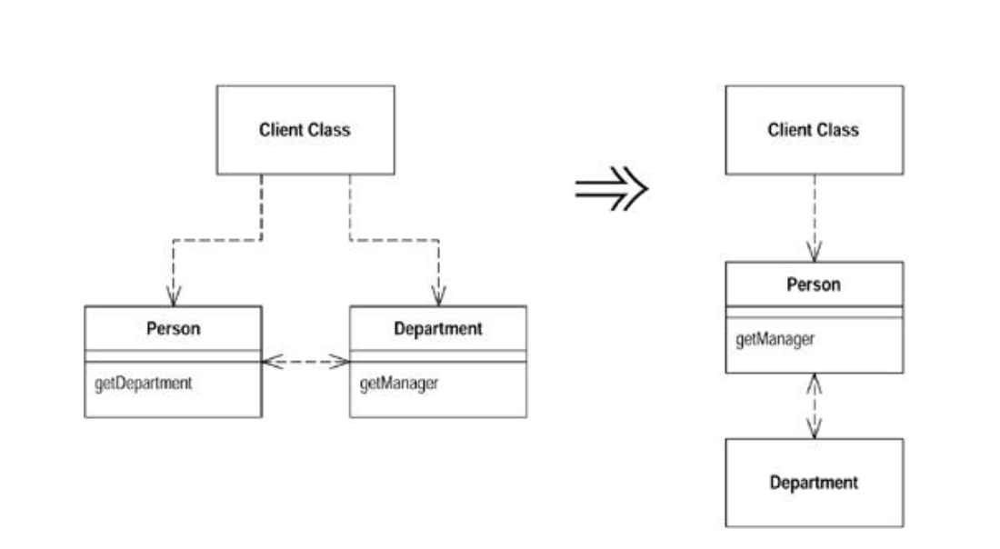
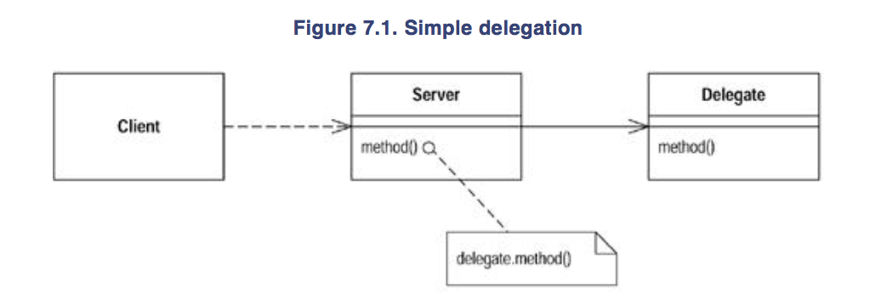

#### Hide Delegate

- A client is calling a delegate class of an object

`Create methods on the server to hide the delegate`

```
Delegation means that an object shall perform only what it knows best, and leave the rest to other objects.
```



###### Motivation

- One of the keys, if not the key, to objects is encapsulation
- Encapsulation means that objects need to know less about the other parts of the system
- Then when things change, fewer objects need to be told about the change - which makes the change easier to make

- Anyone involved in objects knows that you should hide your fields
- As you necome more sophisticated, you realize there is more you can encapsulate

- If a client calls a method defined on one of the fields of the server object, the client needs to know about the delegate object
- If the delegate object changes, the client also may have to change
- You can remove this dependency by placing a simple delegating method on the server which hides the delegate
- Changes become limited to the server and don't propagate to the client



You may find it worthwhile to use `Extract Class` for some clients of the server or all clients
- If you hide from all the clients, you can remove all mention of the delegate from the interface of the server

###### Mechancis

* For each method on the delegate, create a simple delegating method on the server
* Adjust the client to call the server
    - If the client is not in the same package as the server, consider changing the delegate method's access to package visibility
* Test after adjusting each method
* If no client needs to access the delegate anymore, remove the server's accessor to the delegate
* Test

###### Example

- Start with a person and a department

```
class Person {
    Department _department;

    public Department getDepartment() {
        return _department;
    }

    public void setDepartment(Department arg) {
        _department = arg
    }

}

class Department {

    private string _chargeCode;
    private Person _manager;

    public Department(Person manager) {
        _manager = manager;
    }

    public Person getManager() {
        return _manager();
    }
...
}

```

- If a client wants to know the person's manager, if needs to get the department first

`manager = john.getDepartment().getManager();`

- This reveals to the client how the department class works and that the department is responsible for tracking the manager
- Can reduce this coupling by hiding the department class fromt he client
- Do this by creating a simple delegating method on person

```
public Person getManager() {
    return _department.getManager();
}
```

- Now need to change all clients of person to use this new method

`manager = john.getManager();`

- Once made the changes for all the methods of the department and for all the clients of person, you can remove the `getDepartment` accessor on person

```
class Person {
    Department _department;

    public Person getManager() {
        return _department.getManager();
    }

    public void setDepartment(Department arg) {
        _department = arg
    }
}
```