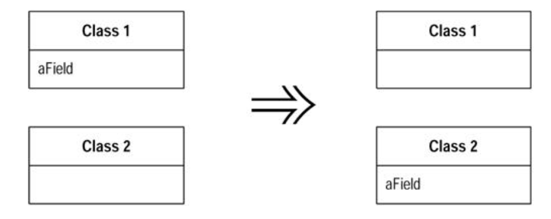

#### Move Field

- A field is, or will be, used by another class more than the class on which it's defined

- `Create a new field in the target class, and change all its users`



###### Motivation

- Moving state and behavior between classes is the very essence of refactoring 
- As the system develops, you find the need for new classes and the need to shuffle responsibilities around
- A design decision that is reasonable and correct one week can become incorrect in another
- `That's not a problem; the only problem is not to do something about it`

- Consider moving a field if you see more methods on another class using the field than the class itself
- This usage may be indirect, through getting and setting methods

- Another reason for field moving is when doing `Extract Class`
- In that case the fields go first and then the methods

###### Mechanics

* If the field is public, use `Encapsulate Field`
     - If you are likely to be moving the methods that access it frequently or if a lot of methods access the field, you may find it useful to use `Self Encapsulate Field`
* Test
* Create a field in the target class with getting and setting methods
* Determine how to reference the target object from the source
    - An existing field or method may give you the target
    - If not, see wheterhy ou can easily create a method that will do so
    - Failing that, you need to create a new field in the source that can store the target
    - This may be a permanent change, but you can also do it temporarily until you have refactored enough to remove it
* Remove the field on the source class
* Replace all references to the source field with references to the appropriate method on the target
    - For accesses to the variable, replace the reference with a call to the target object's getting method; for assignments, replace the reference with a call to the setting method
    - If the field is not private, look in all the subclasses of the source for references

###### Example

```
class Account...
    private AccountType _type;
    private double _interestRate;

    double interestForAmount_days(double amount, int days) {
        return _interestRate * amount * days / 365;
    }
```

- Want to move the interest rate field to the account type
- There are several methods with that reference, of which `interestForAmount_days` is one example
- Next create the field and accessors in the account type

```
class AccountType...
    private double _interestRate;

    void setInterestRate(double arg) {
        _interestRate = arg;
    }

    double getInterestRate() {
        return _interestRate;
    }
```

- Now redirect the methods from the account class to the use account type and remove the interest rate field in the account
- Must remove the field to be sure that the redirection is actually happening

```
private double _interestRate;

double interestForAmount_days(double amount, int days) {
    return _type.getInterestRate() * amount * days / 365;
}

private void setInterestRate(double arg) {
    _interestRate = arg;
}

private double getInterestRate() {
    return _interestRate;
}
```

- Can redirect the clients of the accessors to use the new object later if you want
- Use self-encapsulation allows you to take a smaller step
- This is useful if you're doing a lot of things with the class
- It simplifies `Move Method` to move methods to the target class
- If they refer to the accessor, such references don't need to change