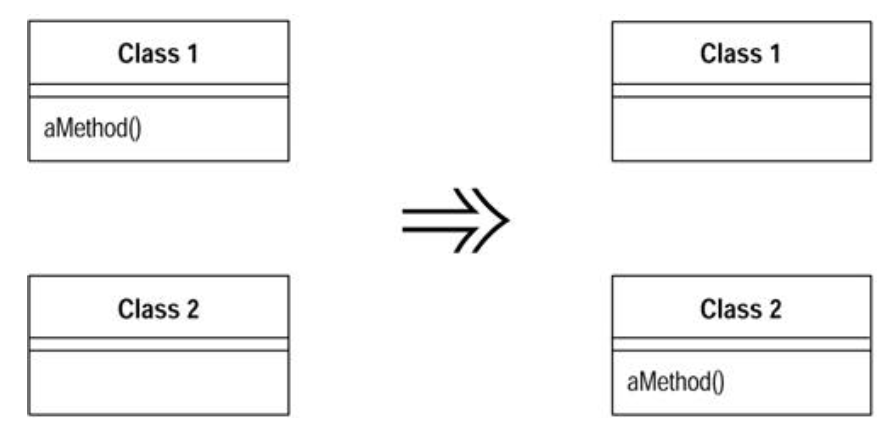

#### Move Method

- A method is, or will be, using or used by more features of another class than the class on which it is defined

- `Create a new method w/ a similar body in the class it uses most. either turn the mold method into a simple delegation, or remove it altogether`

###### Motivation

- Moving methods is the bread and butter of refactoring
- Move methods when classes have too much behavior or when classes are collaborating too much and are too highly coupled
- By moving methods around, you can make the classes simler and they end up being a more crisp implementation and a set of responsibilites

- Look through the methods on a class to find a method that references another objet more than the object it lives on
- Good time to do this is after you have moved some fields
- Take a look at the methods that call it, the methods it calls, and any redefining methods in the hierarchy
- Assess whether to go ahead on the basis of the object with which the method seems to have more interaction

- Not always an easy decision to make
- If not sure whether to move a method, go on to look at other methods
- Moving other methods often makes the decision easier
- Sometimes the decision still is hard to make
- If it is difficult to make the decision, it probably does not matter that mch
- Choose either way according to instict, you can always change it again later

###### Mechanics

- 