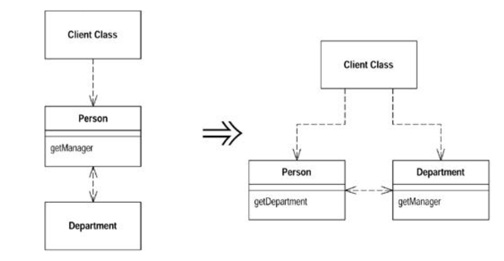

#### Remove Middle Man

- A class is doing too much simple delegation

`Get the client to call the delegate directly`



###### Motivation

- In the motivation for `Hide Delegate`, author talked about advantages of encapsulating the use of a delegated object
- There is a price for this
- The price is that every time the client wants to use a new feature of the delegate, you have to add a simple delegating method to the server
- After adding features for awhile, it becomes painful
- The server class is just a middle man, and perhaps it's time for the client to call the delegate directly

- Hard to figure ut what the right amount of hiding is
- Fortunately with `Hide Delegation` and `Remove Middle Man`, it does not matter so much
- You can adjust your system as time goes on
- As the system changes, the basis for how much you hide also changes
- A good encapsulation six months ago may seem awkward now
- Refactoring means you never have to say you're sorry - just fix it

###### Mechanics

* Create an accessor for the delegate
* For each client use of a delegate method, remove the method from the server and replace the call in the client to call method on the delegate
* Test after each method

###### Example

- For an example, using person and department flipped the other way
- Start with person hiding the department

```
class Person {
    Department _department;
    public Person getManager() {
        return _department.getManager();
    }
}

class Department {
    private Person _manager;
    public Department (Person manager) {
        _manager = manager;
    }
}
```

- To find a person's manager, clients ask

`manager = john.getManager();`

- This is simple to use and encapsulates the department
- However, if a lot of methods are doing this, you end up with too many of these simple delegations on the person
- That's when it is good to remove the middle man
- First make an accessor to the delegate

```
class Person...
    public Department getDepartment() {
        return _department;
    }
}
```

- Then take each method at a time
- Find clients that use the method on person and change it to first get the delegate
- Then use it:

`manager = john.getDepartment().getManager();`

- Can then remove `getManager` from person
- May want to keep some of these delegations for convenience
- Also may want to hide the delegate from some clients but show it to others
- That also will leave some of the simple delegations in place