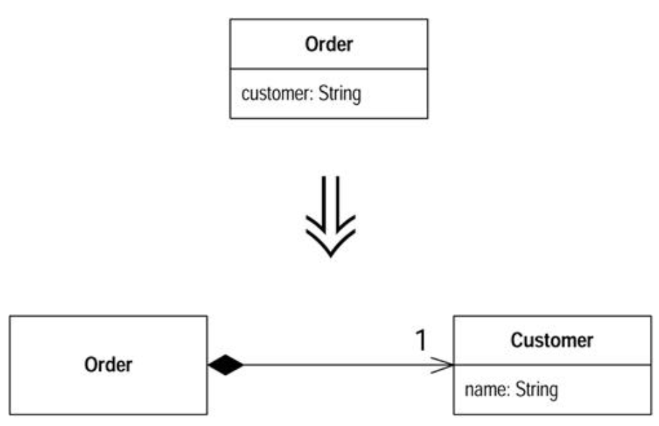

#### Replace Data Value with Object

- You have a data that needs additional data or behavior

- `Turn the data item into an object`



###### Motivation

- Often in the early stages of development you make decisions about representign simple facts as simple data items
- As development proceeds you realize that those simple items aren't so simple anymore
- A telephone number may be represented as a string for awhile, but later you realize that the telephone needs special behavior for formatting, extracting the area code, and the anything else
- For one or two items you may put the methods in the owning object, but quickly the code is problematic b/c of duplication and feature envy
- When this begins, turn the data value into an object

###### Mechanics

* Create the class for the value
* Give it a final field of the same type as the value in the source class. Add a getter and a constructor that takes the field as an argument
* Change the type of the field in the source class to the new class
* If the field is mentioned in the source class constructor, assign the field using the constructor of the new class
* Change the getting method to create a new instance of the new class
* Test
* You may now need to use `Change Value to Reference` on the new object

###### Example

- Start w/ an order class that has stored the customer of the order as a string and wants to turn the customer into an object
- This way you have somewhere to store data, such as an address or credit rating, and useful behavior that uses information

```
class Order...
    public Order (String customer) {
        _customer = customer;
    }
    public String getCustomer() {
        _customer = arg;
    }
    private void setCustomer(String arg) {
        _customer = arg;
    }
    private String _customer;
```

- Some client code that uses this looks like

```
private static int numberOfOrdersFor(Collection orders, String customer) {
    int result = 0;
    Iterator iter = orders.iterator();
    while(iter.hasNext()) {
        Order each = (Order) inter.next()
        if (each.getCustomerName().equals(customer)) result++;
    }
    return result;
}
```

- First create the new customer class
- Give it a final field for a string attribute, b/c that is what the order currently uses

```
class Customer {
    public Customer(String name) {
        _name = name;
    }
    public String getName() {
        return _name;
    }
    private final String _name;
}
```

- Now you change the `type` of the `customer field` and change methdos that reference it to use the appropriate references on the `customer class`
- The getter and constructor are obvious
- For the setter you create a new customer

```
class Order...
    public Order(String customer) {
        _customer = new Customer(customer);
    }
    public String getCustomer() {
        return _customer.getName();
    }
    private Customer _customer;

    public void setCustomer(String arg) {
        _customer = new Customer(customer);
    }
```

- The setter creates a new customer b/c the old string attribute was a value object, and thus the customer currently also is a value object
- This means that each order has its own customer object
- `As a rule value objects should be immutable`
- Later on will want customer to be a reference object, but that's another refactoring
- Test

- Now look at the methods on order that manipulate customer and make some changes to make the new state of affairs cleaner
- With the getter, you can use `Rename Method` to make it clearer that it is the name not the object that is returned

```
public string getCustomerName() {
    return _customer.getName();
}
```

- On the constructor and setter, don't need to change the signature, but the name of the arguments should change

```
public Order (String customerName) {
    _customer = new Customer(customerName);
}
public void setCustomer(String customerName) {
    _customer = new Customer(customerName);
}
```

- Further refactoring may well cause you to add a new constructor and setter that takes an existing customer

- This finished this refactoring
- But there is still more to do
- If you want to add such things as credit rating and addresses to a customer, you cannot do so now
- This is b/c the customer is treated as a value object
- Each order has its own customer object
- To give a customer these attributes you need to apply `Change Value to Reference` to the customer so that all the orders for the same customer share the same customer object