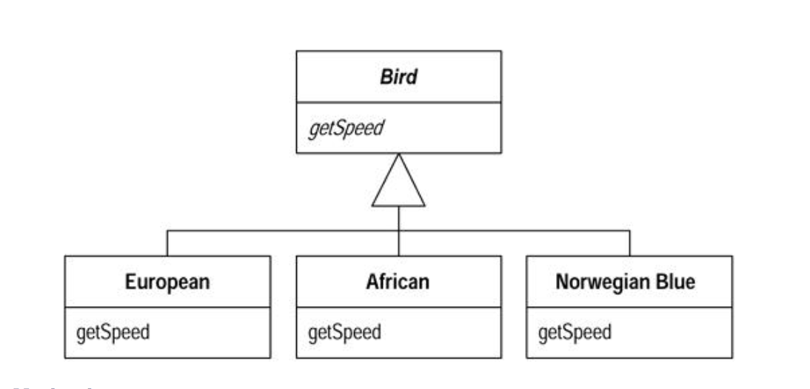
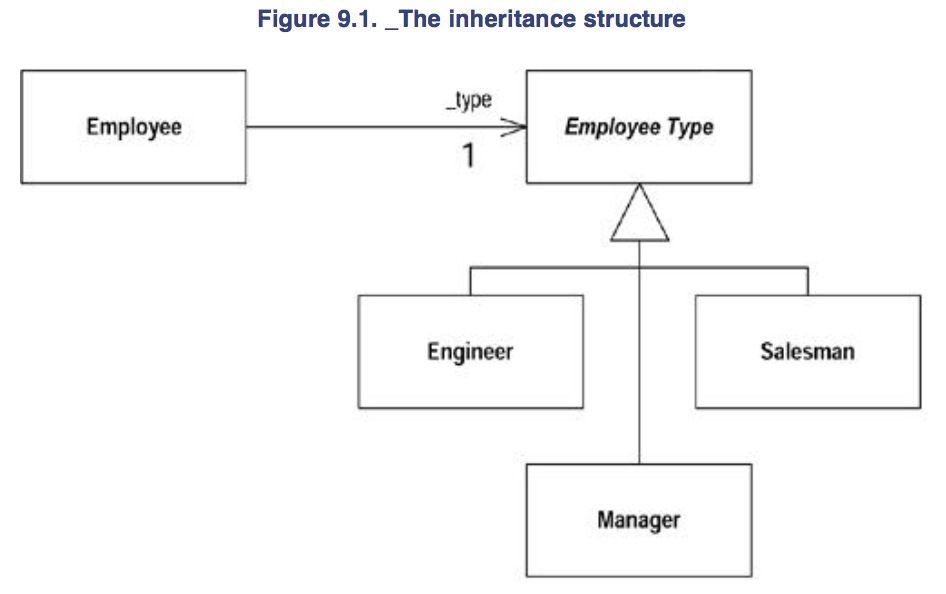

###### Replace Conditional with Polymorphism

- You have a conditional that choses different behavior depending on the type of an object

`Move each leg of the conditional into an overriding method in a subclass. Make the original method abstract`

```
const getSpeed = () => { 
    switch(_type) {
        case EUROPEAN:
            return getBaseSpeed()
        case AFRICAN:
            return getBaseSpeed() - getLoadFactor * _numberOfCoconuts
        case NORWEIGAN_BLUE:
            return (_inNailed) ? 0 : getBaseSpeed(_voltage)
    }
    throw new Error(`should be unreachable`)
}
```

Into



######## Motivation

- `The essence of polymorphism is that it allows you to avoid writing an explicit conditional when you have objects whose behavior varies depending on their types`

- As a result you find that switch statements that switch on type codes or if-then-else statements that switch on type strings are much less common in an object-oriented program

- Polymorphism gives you many advantages
- Biggest gain occurs when this same set of conditions appears in many places in the program
- If you want to add a new type, you have to find and update the conditonals
- But with subclasses you just create a new subclass and provide the appropriate methods
- Clients of the class don't need to know about the subclasses, which reduces the dependencies in your system and makes it easier to update

######## Mechanics

- Before you can begin `Replace Conditional with Polymorphism` you need to have the necessary inheritance structure

- To create the inheritance structure you have two options
    * `Replace Type Code with Subclasses` and `Replace Type Code with State/Strategy`
- Subclasses are the simplest option, so you should use them if you can
- If several case statements are switching on the same type code, you only need to create one inheritance structure for that type code

- You can now attack the conditional
- The code you target may be a switch (case) statement or an if statement

* if the conditional statement is one part of a larger method, take apart the conditonal statement and use the `Extract Method`
* If necessary use `Move Method` to place the conditional at the top of the inheritance structure
* Pick one of the subclasses
    - Create a subclass method that overrides the conditional statement method
    - Copy the body of that leg of the conditional statement into the subclass method and adjust it to fit
* Test
* Remove the copied leg of the conditional statement
* Test
* Repeat with each leg of the conditional statement until all legs are turned into subclass methods
* Make the superclass method abstract



